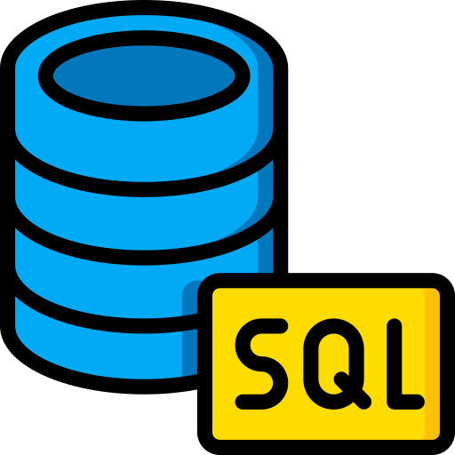

## Olá! Eu sou o Leonardo Rezende 👋

📊 Analista de Dados, com experiência em análise de dados comerciais, criação de dashboards e desenvolvimento de soluções para apoio à tomada de decisão.

🐍 Trabalho com Python, SQL, Excel, Power BI e Pandas, com foco em transformar dados em indicadores, automações e insights de negócio.

Tenho interesse em Data Analytics, Business Intelligence, automação de processos e produtos de dados aplicados a problemas reais.

---

## 📂 Projetos em Destaque

🔹 **Comissão+ — Produto de Dados para Controle Financeiro de Corretores**

- Aplicativo desktop desenvolvido em Python para controle de vendas, comissões, metas e recebimentos  
- Base real anonimizada com **78 vendas** e mais de **R$ 44 milhões em VGV**  
- Indicadores de VGV bruto/equivalente, comissão bruta/líquida, recebidos, pendentes e metas  
- Interface com filtros por ano, mês, origem, carteira e status de recebimento  
- Projeto pessoal criado para comercialização e validado com corretor usuário  

🔗 Acesse o case study:  
https://github.com/oleorezende/comissao-plus-portfolio  

---

🔹 **Dashboard de E-commerce — Power BI**

- Análise de receita, pedidos, ticket médio e avaliação  
- Identificação de produtos, categorias, cidades e plataformas com melhor performance  
- Criação de visão executiva para apoio à tomada de decisão  

🔗 Acesse o projeto:  
https://github.com/oleorezende/projeto-ecommerce-powerbi-analysis  

---

🔹 **Personal Finance Data Pipeline & Dashboard**

- Pipeline completo de dados com Python e Pandas  
- Tratamento, consolidação e análise de dados financeiros  
- Dashboard interativo em HTML com filtros e métricas por categoria  

🔗 Acesse o projeto:  
https://github.com/oleorezende/personal-finance-data-pipeline  

---

## 💻 Linguagens e Ferramentas

<table>
<tr>
  <td align="center" width="90">
    
     Python
  </td>

  <td align="center" width="90">
    
     SQL
  </td>

  <td align="center" width="90">
    
     Pandas
  </td>

  <td align="center" width="90">
    
     Power BI
  </td>

  <td align="center" width="90">
    
     Git
  </td>

  <td align="center" width="90">
    
     Excel
  </td>
</tr>
</table>

---

## 📫 Contato

 

 

